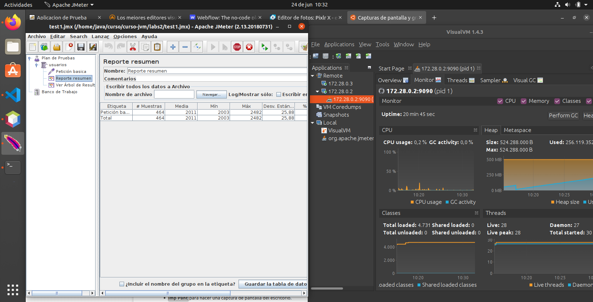

# Curso de optimizacion de la JVM

Calibracion de un servidor:

Un servidor de aplicaciones se necesita saber hasta donde da de sí: (RAM , CPU ...). Cuantas peticiones es capaz de procesar

De qué depende el rendimiento de la aplicación (tiempo de respuesta (está entorno 500ms)) 
* Comunicaciones entre servidor Latencia 20ms
* Cantidad de accesos a sistemas externo que se realizan:
   * Oracle Database JDBC
   * Solr HTTP
 
 Para hacer menos accesos existen varias estrategias:
   * Cache
   * Empaquetar peticiones  
 
La capacidad de carga lo define los recursos CPU / RAM

El rendimiento esta definido por las comunicaciones, por la configuración de los pools de conexiones a BBD y de threads

**Pool de acceso a BBDD**

La consulta a la BBDD lo realiza el driver, que lo gestiona el servidor de aplicaciones (por una delegacion de responsabilidades, el administrador de aplicacion gestiona la información de acceso, no los desarrolladores )

El servidor de aplicaciones aporta un Pool de conexiones - conjunto de conexiones dinamico preestablecidad con la BBDD. Si no hay suficientes hay una cola de conexiones que habrá que  gestionar para su optimización

Qué implica abrir una conexion a BBDD? 
En el servidor de aplicaciones arrancar un nuevo proceso a nivel de SO > 1seg - 2seg

**Pool threads**

si no hay suficientes threads las peticiones se encolan. El número de de ejecutores depende de los recursos. Los recuros (CPU/Ram/Capacidad I/O Disco) límita el número de threads que se pueden crear

Un servlet es ejecutado por un thread
Cada peticiones es atendida en el servidor de aplicaciones por un thread. El thread se gestiona en el pool de ejecutores

Configuración 

* Pool de conexiones a BBDD (min,max, incrementales)
* Pool de thread (ejecutores)

https://www.datadoghq.com/blog/tomcat-architecture-and-performance/#working-with-tomcat-metrics

## MEMORIA JVM

Java gestiona la memoria RAM en la JVM

Las variables permiten almacenar y recuperar información que se encuentra en la memoria RAM de un ordenador, la variable es una referencia a un valor; apunta a una determinada parte de la memoria.

  Integer numero = 7;

* 7 reserva un espacio en memoria y escribe en la ram un 7 
* int numero Genera una variable (numero) para referenciar a número enteros
* = hace que la referencia apunte al valor

  numero = 18;

* reserva un nuevo espacio de memoria  y escribe en la ram un 18
* cambia la referencia de 7 a 18

En este caso hay dos dos zonas de memoria una para 7 y otra para 8. Posteriormente el GC eliminará la memoria ocupada por el 8. 

A diferencia de C que utiliza funciones como malloc para solicitar un bloque de memoria y free para liberarlo; de está manera el uso de la memoria es más óptimo. 

En java la gestión de memoria está menos optimizada, pero se ha simplficado el desarrollo ya que la gestión de la memoria lo hace la JVM. Pero es importante el control del memoria y el uso del GC para que no se den outofmemory errors

**Memoria HEAP**

* En el heap (RAM) se almacenan los objetos que se instancian Cuando el servlet ha terminado su ejecución los objetos creados no sirven para nada, son basura.

* La configuración de la app, no se borran se dicen que son estáticas (static)

* Cache > accesso rápido a información. 

**GARBAJE COLLECTOR GC**

conjunto de hilos que mira que objetos hay en la RAM que no está referenciados.

* 1ª etapa: los objetos no referenciados se marcan para su borrado
* 2ª etapa: se eliminan los objetos marcados 

Por tanto, mientras mayor sea la RAM mas costoso será el proceso de GC. Para que sea menos costoso el proceso se divide la heap en varias zonas

* EDEN - Objetos nuevos - 25%
* OLD - Objetos viejos - 75%

Cuando sea necesario se ejecutará el GC ( Aunque se puede forzar System.gc() pero es considerado un mala practica)

Cuando se llena el eden se ejecuta el GC en el eden. Al ejecutar se eliminar los no referenciados y los referenciados pasan al old. No se hace directamente pasan los survivors A y B que funcionan como un buffer.

Cuando se ejectuta el GC y el OLD está lleno se hace un full GC. tarda 10 veces mas que el GC del eden

Si el GC no puede vaciar se produce un outofmemory. Antes de que se de el outofmemory se ejecuta el bucle el GC hasta que hace que baje el rendimiento hasta que al final colapsa.

Hay que monitorizar la RAM de JVM y del SO. Se puede aumentar la RAM de la JVM hasta el límite de RAM que tenga el SO host. Suele ser un 50-60% el JVM del SO. Despues hay que calibrar el uso:

Parametrizar cantidad de memoria del HEAP:
* Xms Memoria inicial
* Xmx Memoria máxima

La recomendación es que estos valores sean iguales

**Compilacion**

compilador javac genera el bytecode 
dspues la JVM tiene un proceso de interpretado a codigo ejecutable directamente por el SO (código maquina)
la interpretacion se hace en tiempo de ejecucion por el JIT Just in Time Compiler

En la version 1.2 JVM se desarrollo HotSpot que tiene un cache de compilaciones 
La JVM detecta los puntos calientes los cachea y los optimiza

Con el HotSpot se consigue que el rendimiento sea igual que los lenguajes compilados

Las aplicaciones java tiene un **warm time up** para la optimización

**SERVIDORES EN HD**

En un entorno de produccion, hay que tener la politica de HD de la empresa. Teniendo en cuenta que el servidor va a estar en cluster
Si hay dos maquinas en un cluster si una se cae la otra debe poder asumir la carga:

* Tomcat1 40% (CPU/RAM)
* Tomcat2 40%

Ejemplo real Sistema bancario:  4 servidores en weblogic. CPU no puede superar el 25%. App crítica pueden caer 3 servidores y el sistema seguiria funcionando.

**visualvm**

permite monitorizar VM locales y remotos. Instalar plugin VisualGC

paramétros de la JVM

* Logs GC -Xloggc:/tmp/gc.log

* Dump de objetos del heap:-XX:+HeapDumpOnOutOfMemoryError -XX:HeapDumpPath=/tmp/memory.hprof  

Los archivos hprof se pueden importar al visualvm 

Conexion Remota JMX

service:jmx:rmi:///jndi/rmi://[HOST]:[JMXREMOTE_PORT]/jmxrmi

Comandos proceso java

 -Dcom.sun.management.jmxremote
 -Dcom.sun.management.jmxremote.port=12345 
 -Dcom.sun.management.jmxremote.authenticate=false 
 -Dcom.sun.management.jmxremote.ssl=false 
 -Dcom.sun.management.jmxremote.rmi.port=12346

**jmeter**

Herramientas para pruebas de rendimiento (performance). 

Se establece la línea base teniendo en cuenta el rendimiento (tiempo de respuesta) de un usuario. 

A partir de ahí podemos calibrar simulando peticiones (nº de hilos), controlando la CPU/RAM Si el tiempo de respuesta aumenta el servicio se está degradadando ya que las peticiones se encolan.

Para rebajar la linea base se puede optimizar el código

**Repositorio de profesor**

https://github.com/IvanciniGT/cursoOptimizacionJava

